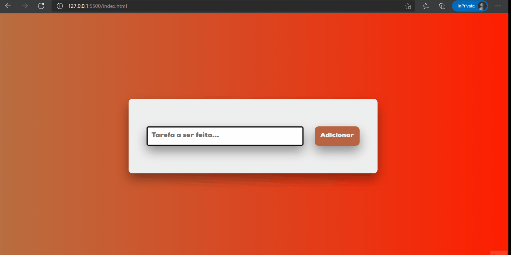

<h1 align="center">Lista de Tarefas</h1>

<h1 align="center">
    
</h1>

<h1 align="center">Sobre</h1>

Uma lista de tarefas simples, usando somente HTML, CSS e JavaScript
  
<h1 align="center">Funcionalidades 🔧</h1>
<ul>
    <li>Pode guardar no LocalStorage as tarefas e se elas já foram concluídas ou não, ou seja, mesmo que a aba seja fechada, as informações não serão perdidas</li>
</ul>  

<h1 align="center">O que aprendi 👨‍💻</h1>
<ul>
    <li>Como utilizar de maneira eficiente o LocalStrorage </li>
    <li>Entendi melhor como funciona o DOM em JS</li>
    <li>Aprendizado de novos métodos de organização da estrutura HTML</li>
</ul>  

Made with 💜 by João Artur 👋 See my <a href="https://www.linkedin.com/in/magalhesartur/">Linkedin</a>

